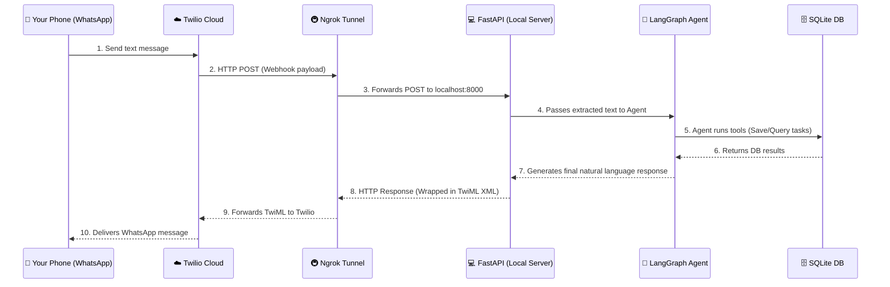
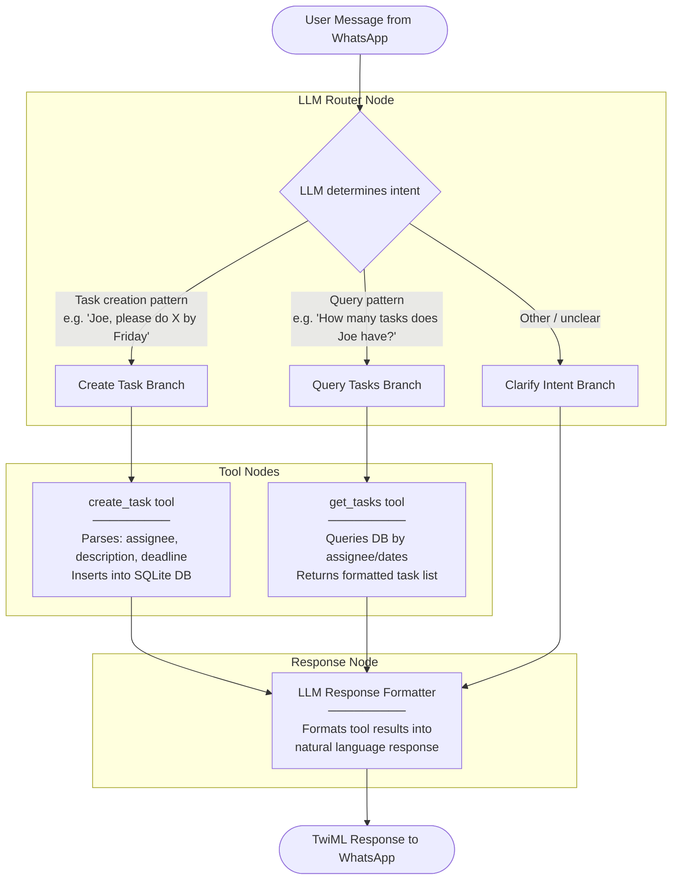

# Product Requirements Document (PRD): WhatsApp Task Extraction & Management Agent (PoC)

## 1. Project Goal
The goal of this project is to build a Proof-of-Concept (PoC) AI agent that connects to WhatsApp to manage team tasks. The agent will act as a virtual project manager with two primary capabilities:

1. **Task Extraction & Storage:** If a user sends a message like "Joe, can you please {task} and finish it {deadline}," the agent will parse the task description, assignee, and due date, and save it to a local SQL database.
2. **Task Querying:** Users can ask the agent questions like "How many tasks does Joe have to finish by Friday?" The agent will query the local SQL database, retrieve the relevant tasks, and return a formatted answer sorted by due date.

This project serves as an educational foundation for orchestrating AI agents with LangGraph, utilizing tool-calling (reading/writing to a DB), and connecting to real-world webhook interfaces.

## 2. Tech Stack
* **Language:** Python
* **Package Manager:** `uv`
* **Agent Framework:** LangChain, LangGraph
* **Database:** SQLite (local file-based SQL database) with `SQLAlchemy` for ORM/Database management
* **Observability:** LangSmith
* **LLM Provider:** Local LLM via Ollama (Model: `llama3.1` or `mistral` for tool-calling capabilities)
* **Web Server:** FastAPI (with `uvicorn`) for receiving incoming webhooks
* **WhatsApp Integration:** Twilio (Sandbox for WhatsApp)
* **Local Tunneling:** Ngrok (to expose local FastAPI server to Twilio)

## 3. Agent Architecture


### The Infrastructure Flowchart
A visual representation of Network/Infrastructure Flow (how the message gets to computer) from the Agent Flow (what we mapped out in the PRD with LangGraph). 



### LangGraph Flow



### Node Summary

| Node | Purpose |
|------|---------|
| `Router` | LLM classifies message intent (create task, query tasks, or clarify) |
| `create_task` | Tool to parse message and save task to SQLite database |
| `get_tasks` | Tool to query tasks from DB by assignee and/or dates |
| `ResponseBuilder` | LLM formats tool results into natural language response |

### Graph Type
`StateGraph` with conditional edges based on LLM router output.


## 4. Testing Framework
* **`pytest`**: Core functional testing framework.
* **`pytest-asyncio`**: To handle asynchronous test functions.
* **`httpx`**: Used alongside FastAPI's `TestClient` to simulate incoming WhatsApp webhook requests.

## 5. Constraints & Out of Scope (What this project is NOT going to do)
* **No External Task Managers:** We are using a local SQLite database for this PoC. We are *not* hooking this up to an external task management API like Jira, Trello, or Asana.
* **No Official WhatsApp Business API:** This PoC will explicitly use the Twilio Sandbox. We are not registering a real WhatsApp Business number or going through Meta's official API verification process.
* **No standard package managers:** All dependency management must strictly use `uv`, and not through `pip`, `poetry`, or `conda`.

## 6. Phases of Development
* **Phase 1: Environment, Tooling & DB Setup.** 
    * Initialize project with `uv` and install dependencies.
    * Set up the `.env` file and ensure Ollama is running locally.
    * Define the SQLAlchemy models and create the local SQLite database table.
  
* **Phase 2: The Agent Tools & LangGraph.** 
    * Build a `create_task` tool (to parse text and insert into the DB).
    * Build a `get_tasks` tool (to query the DB based on assignee/dates).
    * Construct the LangGraph state machine to route the user's message to the correct tool and formulate a conversational response.
  
* **Phase 3: The Webhook Server (FastAPI).** 
    * Create a FastAPI application with an endpoint to receive incoming `POST` requests from Twilio, pass the message to the LangGraph agent, and return a Twilio-formatted XML (TwiML) response.

* **Phase 4: Functional Testing.**
    * Write testing scripts to simulate incoming webhooks and verify the agent correctly writes to and reads from the database.

* **Phase 5: Connecting Twilio + Ngrok.**
    * Run Ngrok to expose the FastAPI server and configure the Twilio Sandbox webhook URL.

## 7. Initial Setup Instructions
**Project Initialization:**
```bash
mkdir whatsapp-task-agent
cd whatsapp-task-agent
uv init
uv venv
source .venv/bin/activate  # Or .venv\Scripts\activate on Windows
```

## 8. Phase Summaries

### Phase 1: Environment, Tooling & DB Setup
**Status:** Completed

**Summary:**
- What was implemented:
  - Initialized project with `uv init` and created virtual environment
  - Added core dependencies: langchain, langgraph, sqlalchemy, fastapi, uvicorn, pydantic, twilio, python-dotenv
  - Added dev dependencies: pytest, pytest-asyncio, httpx, ruff, black, mypy
  - Created `.env` file with environment variables (OLLAMA_BASE_URL, OLLAMA_MODEL, DATABASE_URL, Twilio credentials)
  - Verified Ollama is running locally with nomic-embed-text model
  - Defined SQLAlchemy Task model with id, assignee, description, deadline, created_at, completed fields
  - Created SQLite database with tasks table
  - Verified DB connection with CRUD operations

- Key files created:
  - `src/__init__.py`
  - `src/db/__init__.py`
  - `src/db/models.py` - Task SQLAlchemy model
  - `src/db/database.py` - Database connection and session management
  - `.env` - Environment variables
  - `tasks.db` - SQLite database file
  - `tests/__init__.py`
  - `tests/test_db.py` - Basic DB test

- Verification:
  - Ran `uv run pytest tests/test_db.py -v` - 1 test passed

---

### Phase 2: The Agent Tools & LangGraph
**Status:** Completed

**Summary:**
- What was implemented:
  - Set up Ollama LLM connection using ChatOllama (langchain-ollama)
  - Defined AgentState schema with messages, intent, tool_result, response
  - Built create_task tool with regex parsing for assignee, description, deadline
  - Built get_tasks tool with filtering by assignee and deadline
  - Implemented keyword-based router for intent classification (create/query/clarify)
  - Implemented ResponseBuilder node for natural language formatting
  - Constructed LangGraph StateGraph with conditional edges
  - All tools and nodes are integrated into the agent workflow
  - Added LangSmith tracing for observability and debugging

- Key files created:
  - `src/agent/__init__.py`
  - `src/agent/state.py` - AgentState TypedDict and Intent enum
  - `src/agent/tools.py` - create_task and get_tasks LangChain tools
  - `src/agent/router.py` - Keyword-based intent classification
  - `src/agent/graph.py` - LangGraph StateGraph with router, tools, and response builder
  - `src/agent/langsmith_config.py` - LangSmith tracing configuration

- Verification:
  - Ran `uv run pytest tests/ -v` - 22 tests passed
  - Ran `uv run mypy src/` - No type errors
  - Ran `uv run ruff check src/ tests/` - Linting passed

---

### Phase 3: The Webhook Server (FastAPI)
**Status:** Completed

**Summary:**
- What was implemented:
  - Created FastAPI application entry point (`main.py`)
  - Implemented POST endpoint for Twilio webhooks (`/webhook`)
  - Integrated LangGraph agent with webhook endpoint
  - Return Twilio-formatted XML (TwiML) responses
  - Handle incoming message parsing from Twilio form data (From, To, Body)
  - Added error handling for missing/invalid webhook requests
  - Health check endpoint (`/health`)
  - CORS middleware for development
  - Database initialization on startup via lifespan
  - LangSmith tracing for webhook requests

- Key files created:
  - `main.py` - FastAPI webhook server with Twilio integration
  - `src/api/__init__.py` - API module init (later removed, logic in main.py)

- Verification:
  - Ran `uv run pytest tests/test_webhook.py -v` - 5 tests passed
  - Server can be started with `uv run uvicorn main:app --reload --port 8000`

---

### Phase 4: Functional Testing
**Status:** Completed

**Summary:**
- What was implemented:
  - Set up comprehensive test directory structure
  - Created `conftest.py` with pytest fixtures (db_session)
  - Wrote sync tests for `create_task` tool (6 tests)
  - Wrote sync tests for `get_tasks` tool (5 tests)
  - Wrote sync tests for webhook endpoint simulating Twilio requests (5 tests)
  - Wrote async tests for webhook endpoint using httpx's AsyncClient (4 tests)
  - Added integration tests for full webhook-to-agent flow (4 tests)
  - Agent state schema tests (3 tests)
  - Router intent classification tests (8 tests)
  - LangSmith tracing verification tests (3 tests)
  - Configured pytest asyncio_mode = "auto" in pyproject.toml
  - Fixed lint and type check issues

- Key files created:
  - `tests/conftest.py` - Pytest fixtures
  - `tests/test_db.py` - Database connection tests
  - `tests/test_tools.py` - Tool function tests
  - `tests/test_router.py` - Router tests
  - `tests/test_agent_state.py` - State schema tests
  - `tests/test_agent_graph.py` - Graph compilation/invocation tests
  - `tests/test_webhook.py` - Sync webhook endpoint tests
  - `tests/test_webhook_async.py` - Async webhook tests using httpx AsyncClient
  - `tests/test_integration.py` - Full integration tests
  - `tests/test_langsmith_trace.py` - LangSmith tracing verification

- Verification:
  - Ran `uv run pytest -v` - 38 tests passed (34 sync + 4 async)
  - Ran `uv run ruff check .` - Linting passed
  - Ran `uv run mypy .` - Type checking passed

---

### Phase 5: Connecting Twilio + Ngrok
**Status:** Completed

**Summary:**
- What was implemented:
  - Ngrok installation and configuration guide
  - Twilio WhatsApp Sandbox setup instructions
  - Step-by-step guide to join the sandbox
  - Environment variables configuration for Twilio credentials
  - Webhook URL configuration in Twilio Console
  - End-to-end testing instructions

- Key setup information:
  - **Sandbox Number:** `whatsapp:+14155238886`
  - **Joining:** Send `join <sandbox-code>` to the sandbox number
  - **Webhook:** Configure in Twilio Console > Try WhatsApp > Sandbox settings

- How to run:
  1. Start FastAPI server: `uv run uvicorn main:app --reload --port 8000`
  2. Start ngrok: `ngrok http 8000`
  3. Configure webhook URL in Twilio Console with ngrok URL + `/webhook`
  4. Send test messages to `whatsapp:+14155238886`

- Verification:
  - Send "Ask John to finish the report by Friday" - Task should be created
  - Send "How many tasks does John have?" - Should query tasks
  - Check SQLite database for persisted tasks

### Prerequisites
1. **Twilio Account**: Sign up at https://www.twilio.com/try-twilio
2. **WhatsApp Account**: Install WhatsApp on your phone
3. **Ngrok Account**: Sign up at https://ngrok.com for a free account

### Step-by-Step Implementation

#### 1. Install and Configure Ngrok
```bash
# Download ngrok (macOS)
brew install ngrok

# OR download for other platforms from https://ngrok.com/download

# Connect your ngrok account (get authtoken from https://dashboard.ngrok.com/get-started/your-authtoken)
ngrok config add-authtoken <your-authtoken>
```

#### 2. Join Twilio WhatsApp Sandbox
1. Go to https://console.twilio.com/us1/develop/sms/try-it-out/whatsapp-learn
2. Click **Confirm** to acknowledge the terms
3. Send `join <sandbox-code>` to `whatsapp:+14155238886` from your phone
   - Example: If your sandbox code is "XY123ABC", send: `join XY123ABC`
4. You'll receive a confirmation: "You have successfully subscribed to WhatsApp notifications!"

#### 3. Update .env with Twilio Credentials
```bash
# Get these from https://console.twilio.com/
TWILIO_ACCOUNT_SID=ACxxxxxxxxxxxxxxxxxxxxxxxxxxxxxxxx
TWILIO_AUTH_TOKEN=your_auth_token_here
TWILIO_PHONE_NUMBER=+14155238886  # Sandbox number
```

#### 4. Run the Application
```bash
# Terminal 1: Start FastAPI server
uv run uvicorn main:app --reload --port 8000

# Terminal 2: Start ngrok tunnel
ngrok http 8000

# Note the ngrok URL (e.g., https://abc123xyz.ngrok.io)
```

#### 5. Configure Twilio Sandbox Webhook
1. Go to https://console.twilio.com/us1/develop/sms/try-it-out/whatsapp-learn
2. Click **Sandbox settings**
3. In **When a message comes in**, enter your ngrok URL + `/webhook`
   - Example: `https://abc123xyz.ngrok.io/webhook`
4. Click **Save**

#### 6. Test End-to-End Messaging
Send WhatsApp messages to `whatsapp:+14155238886`:

**Test Task Creation:**
```
Ask John to finish the report by Friday
```
Expected response: "Done! I've created a task for John: 'finish the report' due [date]."

**Test Task Query:**
```
How many tasks does John have?
```
Expected response: "Found 1 task for John: 'finish the report' due [date]"

**Test Clarification:**
```
Hello!
```
Expected response: "I'm a task management assistant. You can: ..."
