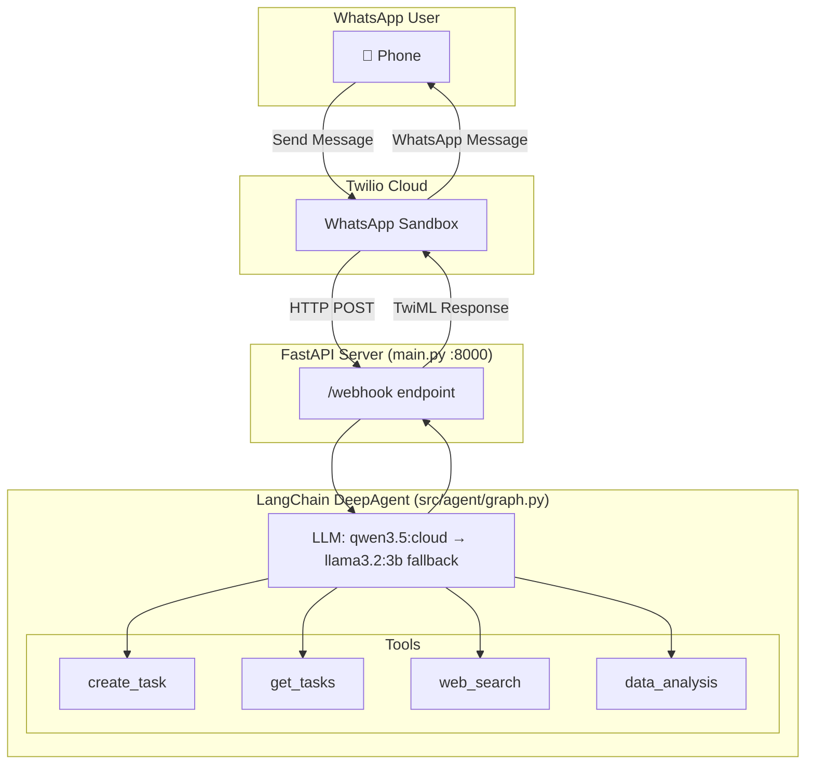

# WhatsApp AI Agent - DeepAgent Implementation

A WhatsApp AI agent built with **LangChain DeepAgent** that handles multiple task types through WhatsApp messaging. Powered by Ollama Cloud (qwen3.5) with local fallback.

## Capabilities

| Tool | Function |
|------|----------|
| `create_task` | Creates a task in the SQLite database |
| `get_tasks` | Queries tasks with optional filters |
| `web_search` | Searches the web for current information (DuckDuckGo) |
| `data_analysis` | Executes Python code for calculations and visualizations (Daytona sandbox) |

## Architecture



## Tech Stack

- **Agent Framework:** LangChain DeepAgent, LangGraph
- **LLM:** Ollama Cloud (qwen3.5:397b-cloud) with local fallback (llama3.2:3b)
- **Database:** SQLite with SQLAlchemy
- **Web Server:** FastAPI + Uvicorn
- **WhatsApp:** Twilio Sandbox
- **Tools:** DuckDuckGo (web search), Daytona (data analysis)

## Environment Variables

```bash
# OLLAMA CONFIGURATION
OLLAMA_BASE_URL=http://localhost:11434

# OLLAMA CLOUD (primary model)
OLLAMA_API_KEY=your_ollama_cloud_key

# DAYTONA (data analysis)
DAYTONA_API_KEY=your_daytona_key

# TWILIO
TWILIO_ACCOUNT_SID=xxx
TWILIO_AUTH_TOKEN=xxx
TWILIO_PHONE_NUMBER=+14155238886

# LANGSMITH (tracing)
LANGSMITH_TRACING=true
LANGSMITH_API_KEY=xxx
```

## Quick Start

```bash
# Install dependencies
uv sync

# Start the server
uv run uvicorn main:app --reload --port 8000

# Health check
curl http://localhost:8000/health
```

## Testing

```bash
# Run all tests
uv run pytest -v

# Run specific test file
uv run pytest tests/test_webhook.py -v
```

## Connect to WhatsApp

1. **Start ngrok:** `ngrok http 8000`
2. **Join Twilio Sandbox:** Send `join <sandbox-code>` to `whatsapp:+14155238886`
3. **Configure webhook:** Set your ngrok URL + `/webhook` in Twilio Console
4. **Test:**

| Message | Expected |
|---------|----------|
| "Ask John to finish the report by Friday" | Creates task |
| "How many tasks does John have?" | Returns task count |
| "What's the capital of France?" | Web search result |
| "Calculate 2+2" | Returns "4" |

## Project Structure

```
ai-agent-whatsapp/
├── main.py                    # FastAPI webhook server
├── pyproject.toml             # Project config
├── .env                       # Environment variables
├── src/
│   ├── agent/
│   │   ├── graph.py          # DeepAgent creation
│   │   ├── tools.py          # Tool definitions
│   │   └── state.py          # AgentState TypedDict
│   └── db/
│       ├── models.py         # SQLAlchemy Task model
│       └── database.py       # Database connection
└── tests/
    └── test_*.py             # Test files
```