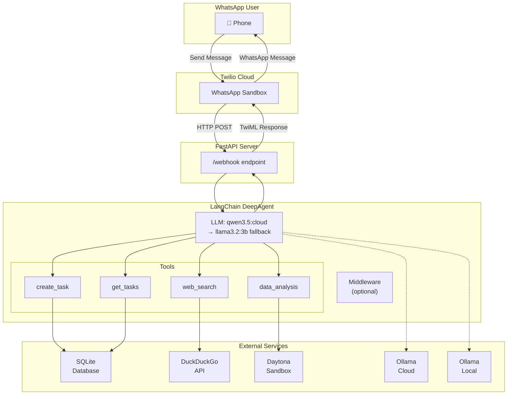

# WhatsApp DeepAgent Implementation Requirements

## Overview

### Project Goal
Convert the existing WhatsApp Task Management Agent to a **LangChain DeepAgent** capable of handling multiple task types through WhatsApp messaging:

1. **Task Management** - Create and query tasks (existing functionality)
2. **Web Search** - Search the web for current information
3. **Data Analysis** - Execute Python code for calculations and generate visualizations

### Motivation
The current agent uses a keyword-based routing approach with manual intent classification. This limits flexibility and requires hardcoded patterns for each capability. Converting to a DeepAgent enables:
- **LLM-driven tool selection** - The model decides which tool to use based on user intent
- **Built-in planning** - Automatic task decomposition for complex requests
- **Extensible architecture** - Easy to add new tools and capabilities
- **Better context management** - Virtual filesystem for handling large amounts of data

---

## Architecture

### System Architecture



### Project Structure

```
ai-agent-whatsapp/
├── main.py                          # FastAPI webhook server
├── pyproject.toml                   # Project configuration
├── .python-version                  # Python version
├── .env                            # Environment variables
│
├── src/
│   ├── __init__.py
│   ├── agent/
│   │   ├── __init__.py
│   │   ├── graph.py                # DeepAgent creation (REFACTOR)
│   │   ├── tools.py                # Tool definitions (MODIFY)
│   │   ├── state.py                # AgentState TypedDict
│   │   ├── router.py               # Intent classification (DEPRECATE)
│   │   └── langsmith_config.py    # LangSmith tracing
│   │
│   └── db/
│       ├── __init__.py
│       ├── models.py               # SQLAlchemy Task model
│       └── database.py             # Database connection
│
└── tests/
    ├── __init__.py
    ├── conftest.py                 # Pytest fixtures
    ├── test_*.py                   # Test modules
    └── test_webhook_async.py       # Async tests
```

### Data Flow

1. User sends WhatsApp message to Twilio Sandbox
2. Twilio forwards to FastAPI `/webhook` endpoint
3. FastAPI extracts message body and passes to DeepAgent
4. DeepAgent:
   - Receives message in state
   - LLM decides which tool to invoke
   - Executes tool and gets result
   - Generates natural language response
5. FastAPI wraps response in TwiML and returns to Twilio
6. Twilio delivers message to user

---

## Tech Stack

### Core Frameworks

| Framework | Version | Purpose |
|-----------|---------|---------|
| `deepagents` | latest | Agent harness for planning, tools, subagents |
| `langgraph` | latest | Runtime for durable execution (dependency of deepagents) |
| `langchain-ollama` | latest | Ollama LLM integration |
| `fastapi` | >=0.135.2 | Web server for webhooks |
| `uvicorn` | >=0.42.0 | ASGI server |

### Libraries & Dependencies

| Package | Purpose | Required |
|---------|---------|----------|
| `deepagents` | DeepAgent framework | ✅ |
| `ddgs` | DuckDuckGo search | ✅ |
| `langchain-daytona-data-analysis` | Data analysis sandbox | ✅ |
| `sqlalchemy` | Database ORM | ✅ |
| `pydantic` | Data validation | ✅ |
| `twilio` | WhatsApp integration | ✅ |
| `python-dotenv` | Environment variables | ✅ |
| `python-multipart` | Form data parsing | ✅ |

### Testing

| Package | Purpose |
|---------|---------|
| `pytest` | Testing framework |
| `pytest-asyncio` | Async test support |
| `httpx` | Async HTTP client |

### Environment Variables

```bash
# Existing
OLLAMA_BASE_URL=http://localhost:11434
OLLAMA_MODEL=llama3.1
DATABASE_URL=sqlite:///./tasks.db
TWILIO_AUTH_TOKEN=xxx
TWILIO_ACCOUNT_SID=xxx
TWILIO_PHONE_NUMBER=xxx
LANGSMITH_TRACING=true
LANGSMITH_API_KEY=xxx

# New - Required
DAYTONA_API_KEY=your_daytona_key          # From app.daytona.io
OLLAMA_API_KEY=your_ollama_cloud_key      # From ollama.com/cloud
```

### Models

| Model | Environment | Base URL | Purpose |
|-------|-------------|----------|---------|
| `qwen3.5:cloud` | Cloud (primary) | `https://api.ollama.cloud/v1` | Main LLM with tool calling |
| `llama3.2:3b` | Local (fallback) | `http://localhost:11434` | Fallback when cloud unavailable |

---

## Changes Summary

### Phase 1: Dependencies
- Install `deepagents`, `ddgs`, `langchain-daytona-data-analysis`

### Phase 2: Environment Configuration
- Add `DAYTONA_API_KEY` and `OLLAMA_API_KEY` to `.env`

### Phase 3: Tool Definitions
- Keep: `create_task`, `get_tasks` (existing)
- Add: `web_search` (DuckDuckGo)
- Add: `data_analysis` (Daytona sandbox)

### Phase 4: DeepAgent Creation
- Refactor `src/agent/graph.py` to use `create_deep_agent`
- Implement model fallback (cloud → local)
- Configure system prompt

### Phase 5: Webhook Handler
- Minimal changes expected (verify invocation pattern)

### Phase 6: Testing
- Test all tool functionalities
- Run pytest suite
- Run lint and type checks

---

## Components Being Replaced

| Component | Status | Reason |
|-----------|--------|--------|
| `router.py` | Deprecated | LLM now handles intent classification |
| `create_task_node` | Removed | Handled by `create_task` tool |
| `get_tasks_node` | Removed | Handled by `get_tasks` tool |
| `response_builder_node` | Removed | Built into DeepAgent |

## Components Being Retained

| Component | Status | Reason |
|-----------|--------|--------|
| `state.py` | Retained | May need for type hints |
| `tools.py` | Retained + Extended | Core tool definitions |
| `database.py` | Unchanged | SQLite connection |
| `models.py` | Unchanged | Task model |

---

## Test Scenarios

| Feature | Test Query | Expected Behavior |
|---------|------------|-------------------|
| Task Creation | "Ask John to finish the report by Friday" | Creates task in DB |
| Task Query | "How many tasks does John have?" | Returns matching tasks |
| Web Search | "What is the capital of France?" | Returns search results |
| Data Analysis (Math) | "Calculate 2+2" | Returns "4" |
| Data Analysis (Plot) | "Create a bar chart of [1,2,3]" | Returns plot artifact |

---

## References

- [DeepAgents Documentation](https://docs.langchain.com/oss/python/deepagents/overview)
- [DuckDuckGo Integration](https://docs.langchain.com/oss/python/integrations/tools/ddg)
- [Daytona Data Analysis Tool](https://docs.langchain.com/oss/python/integrations/tools/daytona_data_analysis)
- [ChatOllama Integration](https://docs.langchain.com/oss/python/integrations/chat/ollama)
- [Ollama Cloud Models](https://ollama.com/search?c=cloud)
